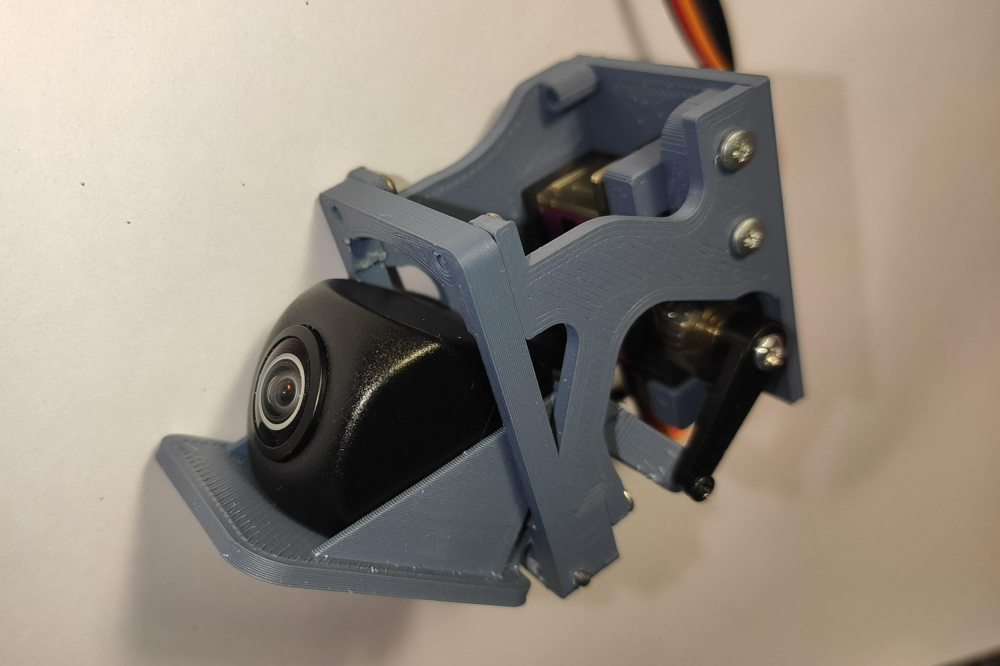
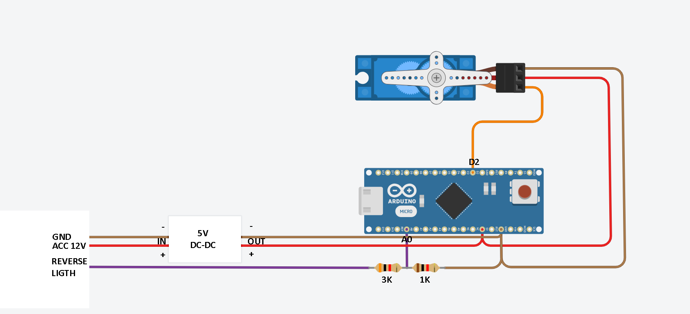

# Arduino sketch for control motorized rear-view camera

Control diy motorized rear-view camera in your car:

This project was designed for Arduino Pro Micro, but you can use any other controller with at least one analog input.

Connection diagram using Arduino Pro Micro as an example:

As can be seen from the above diagram, a voltage divider is used with two resistors to read the signal from the reverse lamp. 
I used resistors of 1k and 3k, which safely allow reading the signal level up to 20V. 
You can calculate the resistors for the voltage divider based on the resistances you have available using this website: https://ohmslawcalculator.com/voltage-divider-calculator

Check my DIY 3d models of motorized cams:
https://www.thingiverse.com/thing:5745347 - Universal motorized camera
https://www.thingiverse.com/thing:6587076 - Motorized camera for volvo S60 S80 P2
